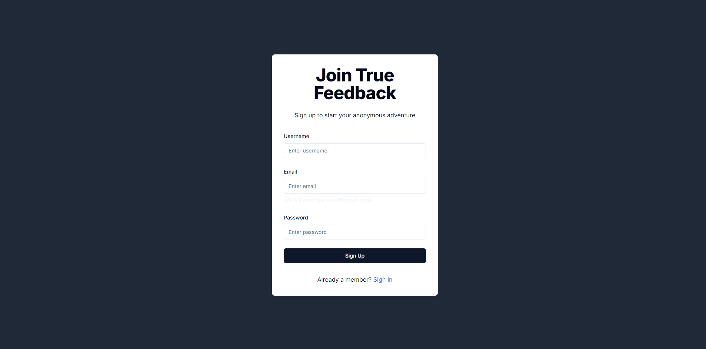
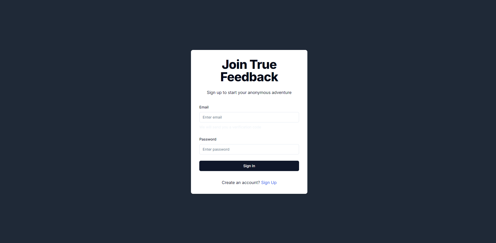
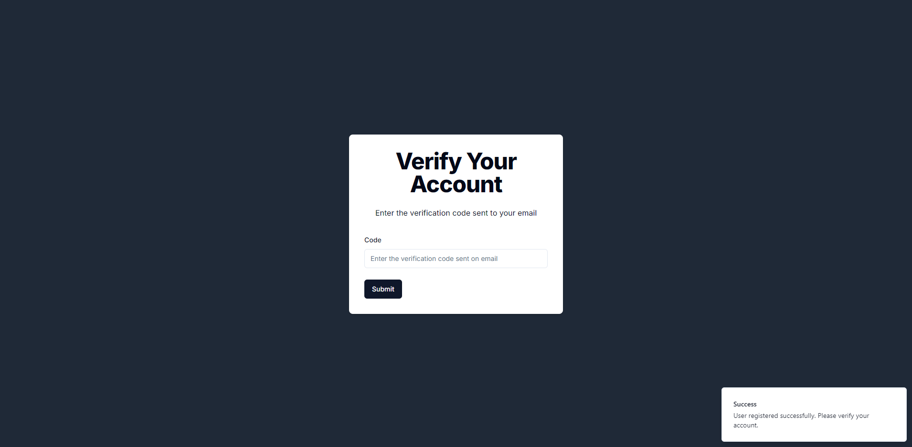
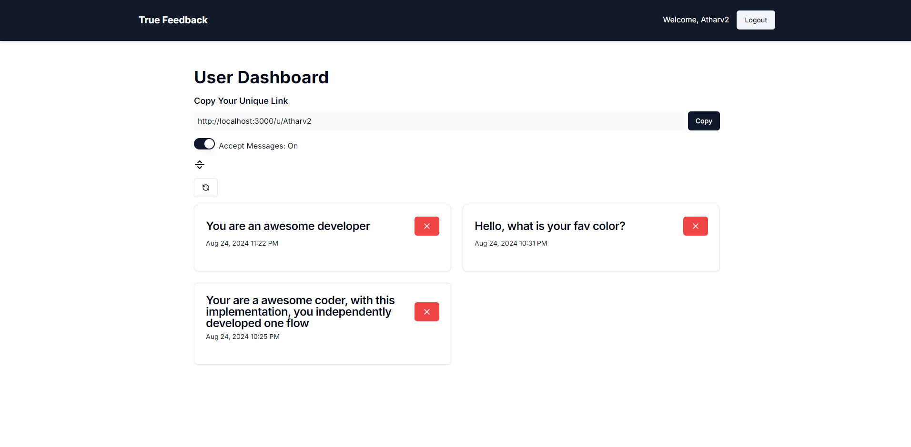
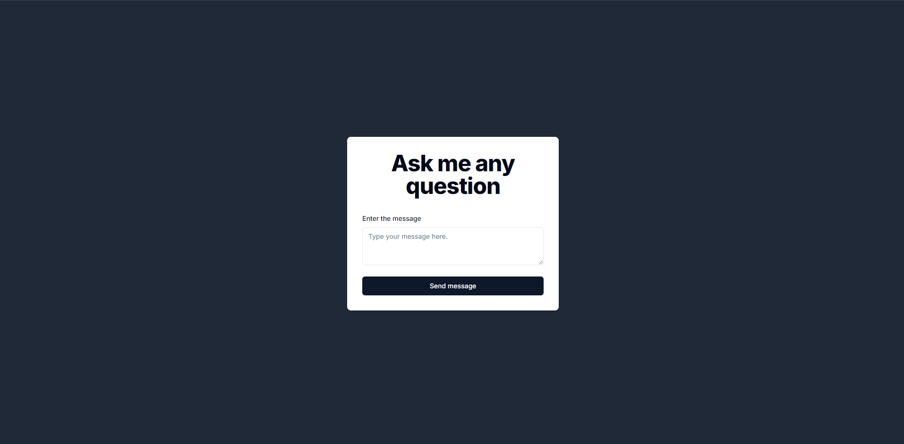
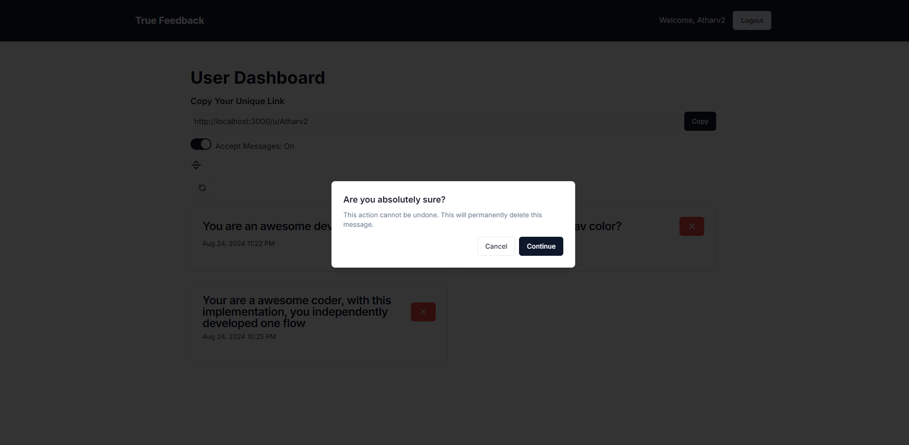

# Mystery Message App

### This is a project mainly focusing on learning how to build apis in next js, with authentication using next auth

Enjoyed a lot building this project, gained a ton on knowledge on how backend apis are built in next js

## Screenshots of UI

### Sign Up

### Sign In

### Verify

### Dashboard

### Ask Questions

### Delete Message

